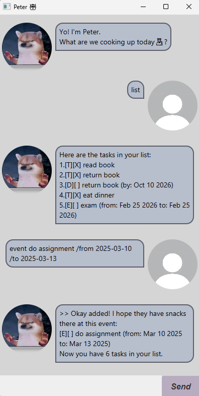

# Peter User Guide



Peter is a friendly task management app that helps you keep track of your todos, deadlines and events
using simple commands.

---
## Quick Start
1. Ensure you have Java 17 or above installed on your computer.
2. Download the latest `peter.jar`.
3. Open a command terminal, navigate to the folder with the jar file
4. Run:
```
java -jar peter.jar
```

---
## Features

### Listing all tasks
Shows all tasks in Peter.
- **Format:** `list`
- **Expected output**:
```
Here are the tasks in your list:
1.[T][X] read book
2.[T][X] return book
3.[D][ ] return book (by: Oct 10 2026)
```

### Adding a Todo
Adds a Todo task to Peter.
- **Format:** `todo <description>`
- **Example:** `todo read book`
- **Expected output**:
```
>> Okay! I've added this todo:
[T][] eat
Now you have 4 tasks in your list.
```


### Adding a Deadline
Adds a Deadline task to Peter.
- **Format:** `deadline <description> /by yyyy-MM-dd`
- **Example:** `deadline return book /by 2026-02-25`
- **Expected output**:
```
>> Time to lock in! I've added this deadline:
[D][] return book (by: Feb 25 2026)
Now you have 5 tasks in your list.
```


### Adding a Event
Adds a Event task to Peter.
- **Format:** `event <description> /from yyyy-MM-dd /to yyyy-MM-dd`
- **Example:** `event exam /from 2026-02-25 /to 2026-02-27`
- **Expected output**:
```
>> Okay added! I hope they have snacks there at this event:
[E][] exam (from: Feb 25 2026 to: Feb 27 2026)
Now you have 6 tasks in your list.
```

### Deleting a task
Deletes a task from Peter.
- **Format:** `delete <index>`
- **Example:** `delete 5`
- **Expected output**:
```
Sent this task to the Shadow Realm:
[D][] return book (by: Feb 25 2026)
Now you have 5 tasks in your list.
```

### Marking a task as done
Marking a specified task as done.
- **Format:** `mark <index>`
- **Example:** `mark 6`
- **Expected output**:
```
LET'S GO! This task is now marked as done:
[E][X] exam (from: Feb 25 2026 to: Feb 27 2026)
```

### Marking a task as undone
Marking a specified task as undone.
- **Format:** `unmark <index>`
- **Example:** `unmark 7`
- **Expected output**:
```
No worries! This task has been unmarked:
[E][X] exam (from: Feb 25 2026 to: Feb 27 2026)
```

### Finding tasks with keyword
Displays all the tasks with the specified keyword.
- **Format:** `find <keyword>`
- **Example:** `find book`
- **Expected output**:
```
Found these "book" tasks in your list:
1. [T][X] read book
2. [D][X] return book (by: Feb 25 2026)
```


### Snoozing a task
Displays all the tasks with the specified keyword.

a. Snoozing deadline
- **Format:** `snooze <index> /by yyyy-MM-dd`
- **Example:** `snooze 3 /by 2025-03-01`
- **Expected output**:
```
Remember to take a break! This task has been snoozed:
[D][X] return book (by: Mar 01 2025)
```

b. Snoozing event
- **Format:** `snooze <index> /from yyyy-MM-dd /to yyyy-MM-dd`
- **Example:** `snooze 4 /from 2025-03-01 /to 2025-03-05`
- **Expected output**:
```
Remember to take a break! This task has been snoozed:
[E][] exam (from: Feb 27 2026 to: Mar 05 2026)
```

### Exiting Peter
Exits the Peter program.
- **Format:** `bye`
- **Expected output**:
```
"Catch you later, boss! Remember to stay hydrated 🤖!"
```